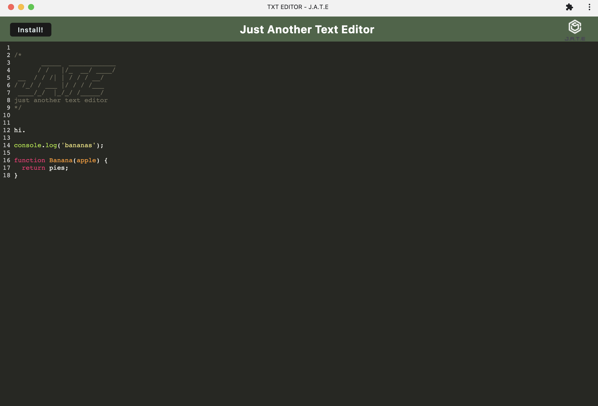

# TEXT EDIT PWA

TEXT EDITOR, or J.A.T.E. (Just Another Text Editor), is a PWA designed to help users journal their notes and code. Txt Editor makes use of service workers, manifest, and IndexedDB. It is installable from the browser, and functions offline. Happy jotting and coding.

## Installation

Visit the application [here](https://txt-editor.herokuapp.com/). To download the application, hit the install button featured in the app's header/nav bar, or the install button located in your browser's address bar.

## Usage

Start typing!! Text Editor supports Javascript and stores your content so it is always accessible, even offline.

Example of some text and code you could write in the application.

## Credits

This application was made possible by [Workbox](https://developer.chrome.com/docs/workbox/modules/workbox-webpack-plugin/), [Webpack](https://webpack.js.org/), [IndexedDB](https://developer.mozilla.org/en-US/docs/Web/API/IndexedDB_API), [idb](https://www.npmjs.com/package/idb), [Babel](https://babeljs.io/), [CodeMirror](https://codemirror.net/), and good ol' [Node](https://nodejs.org/en/) and [Express](https://expressjs.com/) ;). Application deployed on Heroku 💜

## License

Copyright (c) 2022 stardust productions.

MIT License